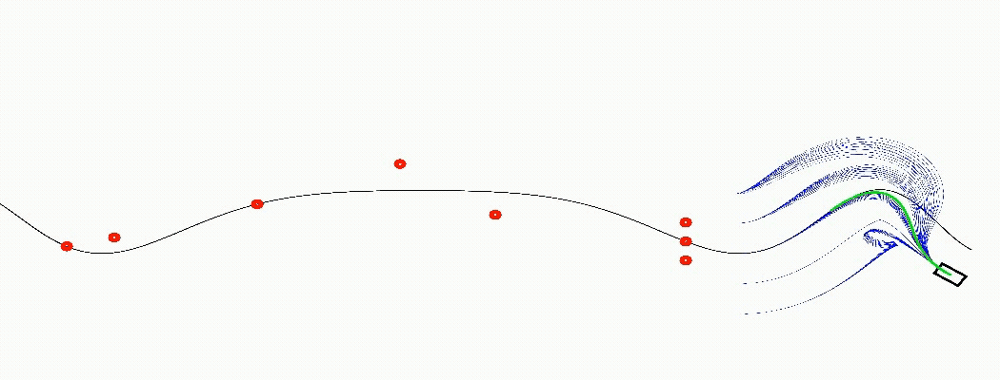

# Frenet Frame Trajectory Planner

A C++ implementation of a Frenet‐frame trajectory planner for vehicle path planning and collision avoidance. Generates and evaluates candidate trajectories in Frenet coordinates, converts them to world coordinates, and selects the optimal, collision‐free path.

---

## Features

- **Candidate Generation**: Sample lateral and longitudinal polynomials over varying horizons, lanes, and speeds.
- **Cost Evaluation**: Compute lateral and longitudinal cost terms (jerk, time, deviation).
- **Collision Checking**: Simple circular‐footprint collision test against static obstacles.
- **Kinematic Constraints**: Enforce maximum velocity, acceleration, and curvature.
- **Visualization**: Draw center lane, obstacles, all candidates, and selected trajectory using OpenCV.
- **Video Output**: Record planning steps to `trajectory.mp4`.

---

---

## Dependencies

- C++17 (or later)
- [Eigen3](https://eigen.tuxfamily.org) (for linear algebra)
- OpenCV (4.x)
- CMake (3.10+)

---

## Build & Installation

```bash
git clone https://github.com/kshitijSharma2204/Trajectory-Generation-In-Frenet-Frame.git
cd Trajectory-Generation-In-Frenet-Frame
mkdir build && cd build
cmake ..
make -j
```

## Usage

from build/ directory
```bash
./main_app
```

## Output

